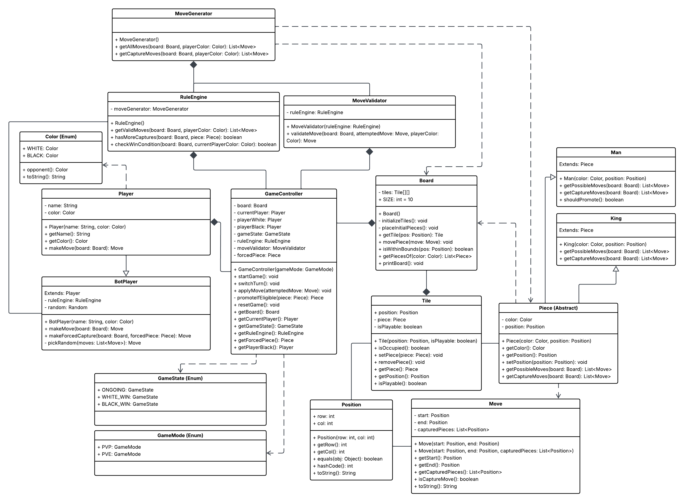
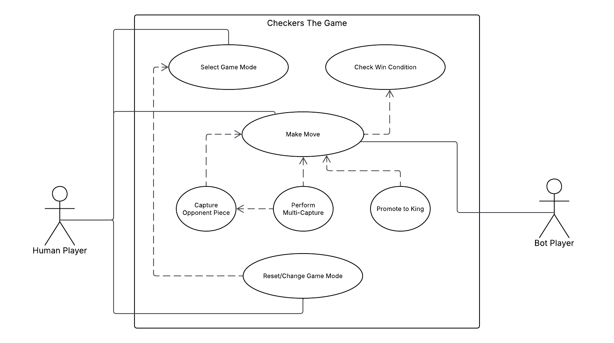

# Checkers-The-Game

This project is an implementation of **International Checkers** (also known as **International Draughts**) using object-oriented programming. The game follows the standard rules of the 10×10 draughts variant, which is widely played in Europe, Africa, and other parts of the world.

### Key Rules

- **Movement**:  
  - Ordinary pieces (men) move **one square diagonally forward** (toward the opponent's side).  
  - Captures are **mandatory** – if a capture is possible, you must take it.  
  - Capturing is done by jumping over an adjacent opponent's piece diagonally, landing on the empty square immediately beyond. Multiple captures in one turn are allowed (and required) if available.

- **Promotion (Kinging)**:  
  When a man reaches the last row (the king's row) on the opponent's side, it becomes a **king**. Kings move **any number of squares diagonally forward or backward** (like a bishop in chess but only on dark squares).

- **Flying Kings**:  
  Kings can slide over empty squares and capture from any distance along a diagonal, provided there is exactly one opponent piece and an empty square beyond. After a long-range capture, the king may land on any empty square behind the captured piece.

- **Win Conditions**:  
  A player wins by capturing all opponent pieces or leaving the opponent with no legal moves.

> **Note**: Unlike American checkers (English draughts), International Checkers uses a larger board, flying kings, and a more complex capture rule that often leads to deeper strategic play.

## UML Diagrams

### Class Diagram

### Use Case Diagram

## Members

- Xyrex T. Antallan
- Lance Christian E. Aropo
- Jose Alejandro C. Mata
- Paolo Ricci A. Manugas

